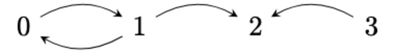

{#title}
# Committing to the bit: Relational programming with semiring arrays and SAT solving

{#authors}
{style="text-align:center"}
### Dmitri Volkov, Yafei Yang, Chung-Chieh Shan

{style="text-align:center"}
### Indiana University

<br />

{style="text-align:center"}
{#repo-link}
> [https://github.com/sporkl/semiringkanren](https://github.com/sporkl/semiringkanren)

<br />

{#title-anchor}
<br />

<br /> <br /> <br /> <br /> <br />

{slip}
{pause}
-----
## Introducing *semiringKanren*:

**miniKanren**{style="float:left"} **semiringKanren**{style="float:right"}

<br />

{pause}
[top-down evaluation]{style="float:left"}
[bottom-up evaluation]{style="float:right"}

<br />

{pause}
[relations compute functions on streams]{style="float:left"}
[relations compute multidimensional arrays]{style="float:right"}

<br />

{pause}
[dynamically typed (s-expressions)]{style="float:left"}
[statically typed (algebraic data types)]{style="float:right"}

<br />

{pause}
[usually unweighted]{style="float:left"}
[weighted]{style="float:right"}

<br />

{pause}
[shallow embedding]{style="float:left"}
[deep embedding]{style="float:right"}

<br />

{style="float:none"}

<br />


{pause}
{#coin-flip-minikanren}
{unreveal="coin-flip-semiringkanren"}
{center}
{.example title="Coin flip - miniKanren"}
---
```
(defrel (coin-flip c)
  (disj
    (== c 'heads)
    (== c 'tails)))
(run* (coin) (coin-flip coin))
```
Returns `'heads` and `'tails`.

{#coin-flip-semiringkanren}
{.example title="Coin flip - semiringKanren"}
---
Represent heads as `(left sole)` and tails as `(right sole)`.
```
(defrel (coin-flip (c : (Sum Unit Unit)))
  (disj
    (fresh (u : Unit)
      (lefto ((c : (Sum Unit Unit)) (u : Unit))))
    (fresh (u : Unit)
      (righto ((c : (Sum Unit Unit)) (u : Unit))))))

(run ((coin : (Sum Unit Unit))) (coin-flip coin))
```
Returns `(left sole)` for heads, and `(right sole)` for tails.

---
{up}
{unreveal="weighted-coin-flip"}
semiringKanren variables are typed.

```
; x has type A, y has type B
(x : A)
(y : B)

; Unit type
(sole : Unit)

; Sum type
((left x) : (Sum A B))
((right y) : (Sum A B))

; Product type
((pair x y) : (Prod A B))

; example: Boolean type
(define Bool (Sum Unit Unit))
(define true (left sole))
(define false (right unit))
```

{reveal="coin-flip-semiringkanren"}
{down="coin-flip-semiringkanren"}

{center="coin-flip-minikanren"}

{pause}
{center="semirings"}
`(factor w)` adds "weight" to a program branch, where `w` is a semiring element.

{#semirings}
{.definition title="Semirings"}
---
A *semiring* (or *rig*) is a set $R$ with $+$ and $*$ operations, with corresponding identity elements $0$ and $1$, such that:

```math
a * (b + c) = (a * b) + (b * c)
```

(and some additional properties).

Examples: real numbers with addition and multiplication, booleans with $\vee$ and $\wedge$.
 
---

{pause}
{center}
{.example title="Weighted coin flip"}
---
Assuming some semiring over $\mathbb{R}$:

```
(defrel (unfair (coin : (Sum Unit Unit)))
  (disj
    (conj
      (factor 0.7)
      (fresh ((u : Unit)) (lefto coin u)))
    (conj
      (factor 0.3)
      (fresh ((u : Unit)) (righto coin u)))))

(run ((coin : (Sum Unit Unit))) (unfair coin))
```

This returns `(left sole)` with weight 0.7, and `(right sole)` with weight 0.3.

---

{up}
{pause}
semiringKanren supports recursion!

{.example title="Transitive closure"}
---

Represent a graph as a relation between nodes (pseudo-syntax):



```
(defrel (grapho (x : Num) (y : Num))
  (disj
    (conj (== x 0) (== y 1))
    (conj (== x 1) (== y 0))
    (conj (== x 1) (== y 2))
    (conj (== x 3) (== y 2))))
```

{pause}
{center}
We can express connectivity (or "transitive closure") in this graph as a recursive relation:

```
(defrel (connecto (x : Num) (y : Num))
  (disj
    (grapho x y)
    (fresh ((z : Num))
      (conj
        (connecto x z)
        (connecto z y)))))
```
{pause}
{center}
{#run-transitive-closure}
```
(run ((x : Num) (y : Num)) (connecto x y))
```
The results change depending on the semiring. For the boolean semiring, we get reachability:

{style="float:right"}

{style="float:none"}

| | **0** | **1** | **2** | **3** |
| **0**&nbsp; | $\top$ | $\top$ | $\top$ | $\bot$ |
| **1**&nbsp; | $\top$ | $\top$ | $\top$ | $\bot$ |
| **2**&nbsp; | $\bot$ | $\bot$ | $\bot$ | $\bot$ |
| **3**&nbsp; | $\bot$ | $\bot$ | $\top$ | $\bot$ |

(`x` is the row, `y` is the column)

{pause}
{center}
For the *min-tropical* semiring $(\mathbb{R}^\infty, \min, +)$, we get the shortest path length:

> | | **0** | **1** | **2** | **3** |
> | **0**&nbsp; | $2$ | $1$ | $2$ | $\infty$ |
> | **1**&nbsp; | $1$ | $2$ | $1$ | $\infty$ |
> | **2**&nbsp; | $\infty$ | $\infty$ | $\infty$ | $\infty$ |
> | **3**&nbsp; | $\infty$ | $\infty$ | $1$ | $\infty$ |

Assuming each path in the original graph is given weight 1 with `(factor 1)`.

{slip}
{pause}
-----

## Semantics and Implementation

<br />

{pause}

{#relations-are-arrays}
> # Relations compute (nd)arrays.
> {style="text-align:center"}
> [(with associated types)]{#with-associated-types}

{pause}
{#variables-are-dimensions}
# Variables are specific dimensions of relation arrays.

{pause}
{#goals-are-operations}
# Goals are operations on relation arrays.

{#variable-vectors}
----

{static="relations-are-arrays variables-are-dimensions"}
{unstatic="goals-are-operations with-associated-types"}
{up="relations-are-arrays"}

{pause}
Values are represented as 1-dimensional arrays.

{.example title="Pair of booleans"}
{up="sole-to-one"}
{pause}
---
`(pair (left sole) (right sole))` of type:

`(Prod (Sum Unit Unit) (Sum Unit Unit))`

{pause}
```math
\text{sole} \leadsto [1]
```

{pause}
{center}
```math
(\text{left}\;\text{sole}) : (\text{Sum}\;\text{Unit}\;\text{Unit}) \leadsto [1] \oplus [0] = [1, 0]
```
```math
(\text{right}\;\text{sole}) : (\text{Sum}\;\text{Unit}\;\text{Unit}) \leadsto [0] \oplus [1] = [0, 1]
```

{pause}
```math
(\text{pair}\;(\text{left}\;\text{sole})\;(\text{right}\;\text{sole})) \leadsto [1, 0] \otimes [0, 1] = [0, 1, 0, 0]
```

{pause}
{center}
All encodings for the type:
```math
(\text{pair}\;(\text{left}\;\text{sole})\;(\text{left}\;\text{sole})) \leadsto [1, 0, 0, 0]
```
```math
(\text{pair}\;(\text{left}\;\text{sole})\;(\text{right}\;\text{sole})) \leadsto [0, 1, 0, 0]
```
```math
(\text{pair}\;(\text{right}\;\text{sole})\;(\text{left}\;\text{sole})) \leadsto [0, 0, 1, 0]
```
```math
(\text{pair}\;(\text{right}\;\text{sole})\;(\text{right}\;\text{sole})) \leadsto [0, 0, 0, 1]
```

---

{pause}
{unreveal="relations-compute-arrays-2"}
{center}
Values become one-hot vectors. Type size becomes vector size.

{#relation-arrays}
----

{#relations-compute-arrays-2}
# Relations compute (nd)arrays.

{pause}
{#two-hot-vector}
{.example title="Two-hot vector"}
---
What if we have something like $[1, 0, 0, 1]$?

{pause}
{reveal="relations-compute-arrays-2"}

{pause}
`(pair (left sole) (left sole))`, `(pair (right sole) (right sole))` succeed! The other values fail.

---

{pause}
{up="relations-compute-arrays-2"}

Relations compute arrays: nonzero entries succeed, zero entries fail.

{pause}

Relations on more than one variable?

{pause}
{center}
{#variables-are-dimensions-2}
# Variables are specific dimensions of relation arrays.

{pause}
{up="variables-are-dimensions-2"}

Consider some relation on two booleans:
```
(defrel (bool-rel (x : Bool) (y : Bool))
  ...)
```

{pause}
Then `x` and `y` each get a dimension of the relation's array:

```math
\begin{matrix}
    \quad \; \; y \rightarrow \\
    x \downarrow
    \begin{bmatrix}
        [a, b], \\
        [c, d] \\
    \end{bmatrix}
\end{matrix}
```

{pause}
{down}
{.example title="Equal booleans"}
---
If we consider the relation where `x` equals `y`...

```
(defrel (equal-bools (x : Bool) (y : Bool))
  (== x y))
```

{pause}
Then `x` should be `true` when `y` is `true`, and same for `false`.

{style="float:right"}
```math
\begin{bmatrix}
[1, 0], \\
[0, 1]
\end{bmatrix}
```

{style="float:none"}
> | | `true` &nbsp;&nbsp; | `false` |
> | --- | --- | --- |
> | **`true`** &nbsp;| $1$ | $0$ |
> | **`false`** &nbsp;| $0$ | $1$ |

{pause}
{center}
{.example title="One specific boolean"}
---
If we consider a relation where only one variable is conditioned:

```
(defrel (one-specific-bool (x : Bool) (y : Bool))
  (trueo x))
```

{pause}
{unreveal="goals-are-operations-2"}
Then the values for each variable are restricted/unrestricted accordingly:

{style="float:right"}
```math
\begin{bmatrix}
[1, 1], \\
[0, 0]
\end{bmatrix}
```

{style="float:none"}
> | | `true` &nbsp;&nbsp; | `false`&nbsp;&nbsp; |
> | --- | --- | --- |
> | **`true`** | $1$ | $1$ |
> | **`false`** &nbsp; | $0$ | $0$ |

{#goal-operations}
----

{#goals-are-operations-2}
# Goals are operations on relation arrays.

{center}
{pause}
How do we use these relation arrays in practice?

{pause}
{reveal="goals-are-operations-2"}
{up="goals-are-operations-2"}

{pause}
There are two classes of goals:

{pause}
{#relation-goals}
> ## Low-level relations
> `soleo`, `lefto`, `righto`, `pairo`, `==`, `=/=`, `succeed`, `fail`, `factor`,<br />and relation application

{pause}
{#combine-goals}
> ## Goal combinators
> `conj`, `disj`, `fresh`.

{pause}
{static="relation-goals"}
{unstatic="combine-goals"}
{up="relation-goals"}

{pause}

[`(== x y)`]{style="float:left"}
```math
\begin{bmatrix}
1 & 0 & 0 \\
0 & \ddots & 0 \\
0 & 0 & 1
\end{bmatrix}
```

{pause}

[`(=/= x y)`]{style="float:left"}
```math
\begin{bmatrix}
0 & 1 & 1 \\
1 & \ddots & 1 \\
1 & 1 & 0
\end{bmatrix}
```

{pause}
{center}

[`(lefto y x)`]{style="float:left"}
```math
\begin{bmatrix}
    \begin{matrix}
        1 & 0 \\
        0 & 1 \\
    \end{matrix} &&
    \begin{matrix} \huge{0} & & \end{matrix}
\end{bmatrix}
```

[`(righto y x)`]{style="float:left"}
```math
\begin{bmatrix}
    \begin{matrix} & & \huge{0} \end{matrix}&&
    \begin{matrix}
        1 & 0 \\
        0 & 1 \\
    \end{matrix}
\end{bmatrix}
```

{pause}
{center}
[`(pairo y x _)`]{style="float:left"}
```math
\begin{bmatrix}
1 & 1 & 0 & 0 \\
0 & 0 & 1 & 1
\end{bmatrix}
```

[`(pairo y _ x)`]{style="float:left"}
```math
\begin{bmatrix}
1 & 0 & 1 & 0 \\
0 & 1 & 0 & 1
\end{bmatrix}
```

{pause}
{center}
[`(factor 120)`]{style="float:left"}
```math
\begin{bmatrix}
120 & 120 & 120 \\
120 & \ddots & 120 \\
120 & 120 & 120
\end{bmatrix}
```

{pause}

`succeed` is `(factor 1)`, `fail` is `(factor 0)`.

{pause}

Relation application unifies argument variables with precalculated relation array variables.

{pause}
{center}
{#goal-combinators-2}
> ## Goal combinators
> `conj`, `disj`, `fresh`.

{pause}
{up="goal-combinators-2"}

`conj` uses semiring multiplication:

```math
(\text{conj}\;
\begin{bmatrix}
2 & 2 & 2 \\
1 & 1 & 1 \\
0 & 0 & 0
\end{bmatrix}
\;
\begin{bmatrix}
0 & 1 & 2 \\
0 & 1 & 2 \\
0 & 1 & 2
\end{bmatrix})
\leadsto
\begin{bmatrix}
0 & 2 & 4 \\
0 & 1 & 2 \\
0 & 0 & 0
\end{bmatrix}
```

{pause}

`disj` uses semiring addition:
```math
(\text{disj}\;
\begin{bmatrix}
2 & 2 & 2 \\
1 & 1 & 1 \\
0 & 0 & 0
\end{bmatrix}
\;
\begin{bmatrix}
0 & 1 & 2 \\
0 & 1 & 2 \\
0 & 1 & 2
\end{bmatrix})
\leadsto
\begin{bmatrix}
2 & 3 & 4 \\
1 & 2 & 3 \\
0 & 1 & 2
\end{bmatrix}
```

{pause}
{center}
`fresh` uses summation:
```math
(\text{fresh}\;(x:\dots)\;
\begin{bmatrix}
0 & 1 & 2 \\
0 & 1 & 2 \\
0 & 1 & 2
\end{bmatrix})
\leadsto
\begin{bmatrix}
0 & 3 & 6
\end{bmatrix}
```

----

{pause}
{center}
{#what-about-recursion}
## What about recursion?

{pause}
{up="what-about-recursion"}
Assume relations *fail* until we have more information.

{pause}
Recompute once we have the information.

{pause}
Repeat until there's no new information - program execution by *fixpoint*.

{.example title="Transitive closure step-by-step"}
---

Recall transitive closure example with $(\mathbb{R}^\infty,\min,+)$: []{style="float:right"}

```
(defrel (connecto (x : Num) (y : Num))
  (disj
    (grapho x y)
    (fresh ((z : Num))
      (conj
        (connecto x z)
        (connecto z y)))))
```

{pause}
{center}
First assume nothing: []{style="float:right"}
<br /><br />

```math
\begin{bmatrix}
\infty & \infty & \infty & \infty \\
\infty & \infty & \infty & \infty \\
\infty & \infty & \infty & \infty \\
\infty & \infty & \infty & \infty \\
\end{bmatrix}
```

{pause}
{center}
`connecto` calls fail, but `grapho` calls do not:
```math
\begin{bmatrix}
\infty & 1 & \infty & \infty \\
1 & \infty & 1 & \infty \\
\infty & \infty & \infty & \infty \\
\infty & \infty & 1 & \infty \\
\end{bmatrix}
```

{pause}
{center}
Now we can consider intermediate vertices:
```math
\begin{bmatrix}
2 & 1 & 2 & \infty \\
1 & 2 & 1 & \infty \\
\infty & \infty & \infty & \infty \\
\infty & \infty & 1 & \infty \\
\end{bmatrix}
```

Re-evaluating `connecto` gets the same result. All done! []{style="float:right"}

---

{pause}
{down}
> This is "bottom-up evaluation", similar to Datalog.
> <br /> <br />

{slip}
{pause}
-----

The end.

{pause}
## ...

{pause}
# But what about committing to the bit!?

{style="text-align:center"}
This presentation didn't really have any jokes...

<br />

{pause}
"The joke is that there are no jokes."

{pause}
"The joke is the meta-humor that 'the joke is that there are no jokes' isn't really that funny."

{pause}
"The joke is that the meta-humor isn't really that funny."

{pause}
"The joke is that the meta-humor *still* isn't really that funny."

{pause}
We have finished computing the joke by fixpoint.

<br />

{pause}
{up}
## Compiling ADTs to bitstrings

No arbitrary sum types, only booleans.

{pause}

```math
(\text{Sum}\;A\;B) \leadsto (\text{Prod}\;\text{Bool}\;\max(A', B'))
```
Where `A'` and `B'` are the bitstring representations of `A` and `B`.

{pause}
Assuming $|B'|>|A'|$:
```math
(\text{left}\;x) \leadsto (\text{pair}\;\text{true}\;\text{proj}_{B'}(x'))
```
```math
(\text{right}\;y) \leadsto (\text{pair}\;\text{false}\;y')
```

Smaller type is coerced into larger type.

{pause}
{down}
{.example title="Quaternary values"}
{unstatic="quat-2 quat-3 quat-4"}
---

{#quat-1}
> Nested sum type with four total values.
>
> `(Sum` `Unit` `(Sum` `Unit` `(Sum` `Unit` `Unit)))` $\leadsto$ `(Prod` `Bool` `(Prod` `Bool` `Bool))`
> 
> `(left` `sole)` $\leadsto$ `(pair` `true` `(pair` `true` `true))`
> 
> `(right` `(left` `sole))` $\leadsto$ `(pair` `false` `(pair` `true` `true))`
>
> `(right` `(right` `(left` `sole)))` $\leadsto$ `(pair` `false` `(pair` `false` `true))`
>
> `(right` `(right` `(right` `sole)))` $\leadsto$ `(pair` `false` `(pair` `false` `false))`

{#quat-2}
{static}
{unstatic="quat-1"}
> Start from the innermost type.
>
> `(Sum` `Unit` `(Sum` `Unit` [`(Sum` `Unit` `Unit)`]{style="background-color:orange"}`))` $\leadsto$ `(Prod` `Bool` `(Prod` `Bool` [`Bool`]{style="background-color:orange"}`))`
> 
> `(left` `sole)` $\leadsto$ `(pair` `true` `(pair` `true` `true))`
> 
> `(right` `(left` `sole))` $\leadsto$ `(pair` `false` `(pair` `true` `true))`
>
> `(right` `(right` [`(left` `sole)`]{style="background-color:orange"}`))` $\leadsto$ `(pair` `false` `(pair` `false` [`true`]{style="background-color:orange"}`))`
>
> `(right` `(right` [`(right` `sole)`]{style="background-color:orange"}`))` $\leadsto$ `(pair` `false` `(pair` `false` [`false`]{style="background-color:orange"}`))`

{#quat-3}
{static}
{unstatic="quat-2"}
> One level up.
>
> `(Sum` `Unit` [`(Sum` [`Unit`]{style="background-color:orange"} [`(Sum` `Unit` `Unit)`]{style="background-color:orange"}`)`]{style="background-color:hotpink"}`)` $\leadsto$ `(Prod` `Bool` [`(Prod` `Bool` [`Bool`]{style="background-color:orange"}`)`]{style="background-color:hotpink"}`)`
> 
> `(left` `sole)` $\leadsto$ `(pair` `true` `(pair` `true` `true))`
> 
> `(right` [`(left` [`sole`]{style="background-color:orange"}`)`]{style="background-color:hotpink"}`)` $\leadsto$ `(pair` `false` [`(pair` `true` [`true`]{style="background-color:orange"}`)`]{style="background-color:hotpink"}`)`
>
> `(right` [`(right` [`(left` `sole)`]{style="background-color:orange"}`)`]{style="background-color:hotpink"}`)` $\leadsto$ `(pair` `false` [`(pair` `false` [`true`]{style="background-color:orange"}`)`]{style="background-color:hotpink"}`)`
>
> `(right` [`(right` [`(right` `sole)`]{style="background-color:orange"}`)`]{style="background-color:hotpink"}`)` $\leadsto$ `(pair` `false` [`(pair` `false` [`false`]{style="background-color:orange"}`)`]{style="background-color:hotpink"}`)`

{#quat-4}
{static}
{unstatic="quat-3"}
> The full type!
>
> [`(Sum` [`Unit`]{style="background-color:hotpink"} [`(Sum` [`Unit`]{style="background-color:orange"} [`(Sum` `Unit` `Unit)`]{style="background-color:orange"}`)`]{style="background-color:hotpink"}`)`]{style="background-color:cyan"} $\leadsto$ [`(Prod` `Bool` [`(Prod` `Bool` [`Bool`]{style="background-color:orange"}`)`]{style="background-color:hotpink"}`)`]{style="background-color:cyan"}
> 
> [`(left` [`sole`]{style="background-color:hotpink"}`)`]{style="background-color:cyan"} $\leadsto$ [`(pair` `true` [`(pair` `true` `true)`]{style="background-color:hotpink"}`)`]{style="background-color:cyan"}
> 
> [`(right` [`(left` [`sole`]{style="background-color:orange"}`)`]{style="background-color:hotpink"}`)`]{style="background-color:cyan"} $\leadsto$ [`(pair` `false` [`(pair` `true` [`true`]{style="background-color:orange"}`)`]{style="background-color:hotpink"}`)`]{style="background-color:cyan"}
>
> [`(right` [`(right` [`(left` `sole)`]{style="background-color:orange"}`)`]{style="background-color:hotpink"}`)`]{style="background-color:cyan"} $\leadsto$ [`(pair` `false` [`(pair` `false` [`true`]{style="background-color:orange"}`)`]{style="background-color:hotpink"}`)`]{style="background-color:cyan"}
>
> [`(right` [`(right` [`(right` `sole)`]{style="background-color:orange"}`)`]{style="background-color:hotpink"}`)`]{style="background-color:cyan"} $\leadsto$ [`(pair` `false` [`(pair` `false` [`false`]{style="background-color:orange"}`)`]{style="background-color:hotpink"}`)`]{style="background-color:cyan"}


---
{pause}
{down}
> `(Sum Unit (Sum Unit (Sum Unit Unit)))` has four values.
> 
> `(Prod Bool (Prod Bool Bool))` has eight values.
> 
> Why the inefficiency? <br /><br />

{pause}
{up}
## Adapting semiringKanren code to use bitstrings

Assuming $|A'|<|B'|$:
```
(righto (x : (Sum A B)) (y : B))
```
{pause}
becomes
```
(fresh (b : B')
  (fresh (tag : Bool)
    (conj
      (pairo (x : (Prod Bool B')) (tag : Bool) (b : B'))
      (falseo (tag : Bool))
      (== (b : B') (y : B'))
```

{pause}
{down}
> ```
> (lefto (x : (Sum A B)) (y : A))
> ```
> becomes
> ```
> (fresh (a : B')
>   (fresh (tag : Bool)
>     (conj
>       (pairo (x : (Prod Bool B')) (tag : Bool) (a : B'))
>       (trueo (tag : Bool))
>       (coerced-== (a : B') (y : A')))))
> ```

{pause}
{center}
`lefto` and `righto` become `trueo` and `falseo`, plus (coerced) unification.

semiringKanren generates type-safe code for each coerced unification.

<br />

{pause}
Note that `(Prod Bool (Prod Bool Bool))` can have $2^3=8$ values, but `(Sum Unit (Sum Unit (Sum Unit Unit)))` has $1 + 1 + 1 + 1 = 4$ values.

semiringKanren constrains variables (relation arguments or `fresh`) to correspond to original values.

{pause}
{up}
{#sat-solving-semiringkanren}
## SAT solving semiringKanren

With bitstrings, easy to translate to SAT.

{pause}
```math
(\text{trueo}\;x) \leadsto x
```
```math
(\text{falseo}\;x) \leadsto \neg x
```
```math
(\text{==}\;x\;y) \leadsto x\;\text{==}\;y
```
```math
(\text{conj}\;x\;y) \leadsto x \wedge y
```
```math
(\text{disj}\;x\;y) \leadsto x \vee y
```

{pause}
{unreveal="future-work"}
Evaluates over the boolean semiring. Satisfying expressions succeed, unsatisfying expressions fail.

{pause}
Note: we inline relation calls and recursions to a finite depth; false negatives.

{pause}
{center}
Benchmarks:

| Sudoku program &nbsp;&nbsp; | semiringKanren&nbsp;&nbsp; | SAT solver&nbsp;&nbsp; | Faster miniKanren |
| --- | --- | --- | --- |
| 4x4 | Out of memory | 0.227 | 0.746 |
| 9x9, medium | Out of memory | 25.814 | Timeout |
| 9x9, hard | Out of memory | 28.043 | Timeout |
| 9x9, expert | Out of memory | 72.088 | Timeout |

{slip}
{reveal="future-work"}
-----

{#future-work}
## Future work

{pause}
- Polymorphic relations
    - Without generating a new relation array for each type?
{pause}
- Recursive types
{pause}
- SMT solver for smarter recursion and other semirings?
{pause}
- Quantum computing/annealing
    - relation arrays look like superpositions of argument variable values.
    - get reversibility "for free"
        - can do `(run (q) (rel 1 q))` or `(run (q) (rel q 1))`.
{pause}
- Fixpoint convergence for different semirings
{pause}
- Applications of different semirings

{center="~duration:5 authors"}
{reveal="repo-link"}

<style>
body {
    font-size: 42px;
}
</style>
